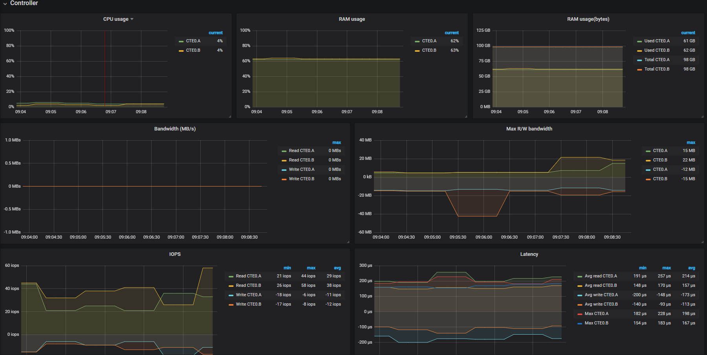
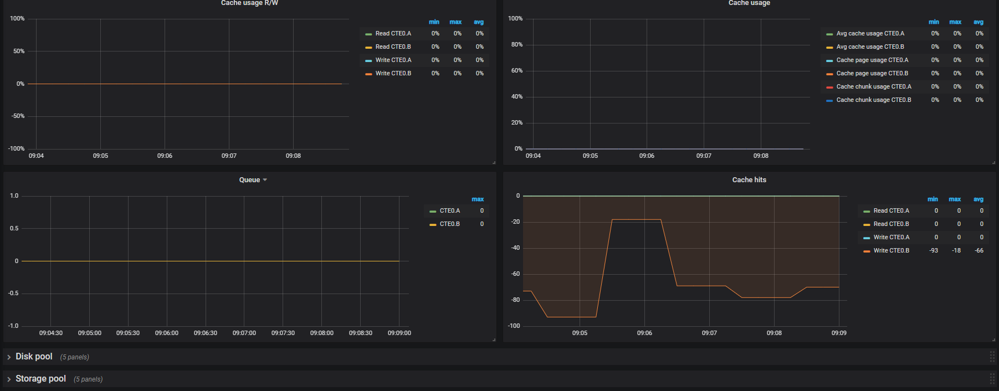
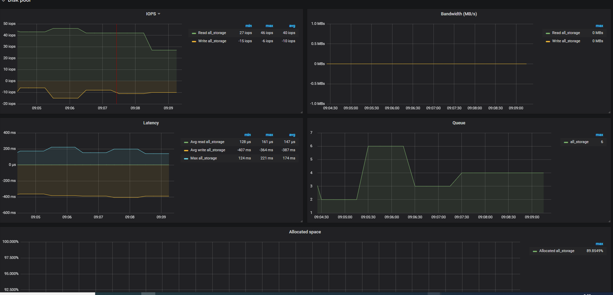
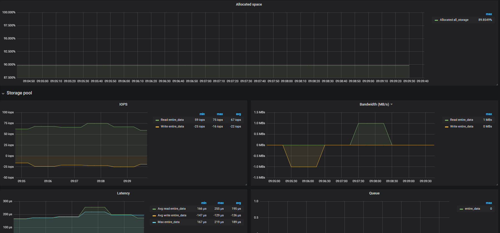

## Running exporter

1. git clone this repo
3. Specify credentials in `dorado_exporter/config.ini`.
4. Run `docker-compose up`
5. Configure prometheus based on the example configuration

## Dashboard installation

1. Install Boomtable panel. `grafana-cli plugins install yesoreyeram-boomtable-panel`
2. Import grafana/grafana_dashboard.json to your Grafana installation
3. Enjoy =)

## Overview

## Description
Prometheus exporter for Huawei Dorado SAN

Collects metrics from Huawei storages' API

### Collected metrics:
* All components
    * running status
    * health status
* Disk
    * read_iops
    * read_mbytes
    * write_iops
    * write_mbytes
    * avg_read_latency
    * avg_write_latency
    * queue_length
* BBU
    * remainlife
* Enclosure
    * temperature
* Controller
    * cpu usage
    * ram size
    * ram usage
    * queue_length
    * read_iops
    * read_mbytes
    * write_iops
    * write_mbytes
    * max_latency
    * avg_read_latency
    * avg_write_latency
    * avg_cpu_usage
    * avg_cache_usage
    * read_cache_hits
    * write_cache_hits
    * read_cache_usage
    * write_cache_usage
    * cache_page_usage
    * cache_chunk_usage
    * max_read_kbytes
    * max_write_kbytes
* Eth ports
    * errors count
    * usage
    * queue_length
    * read_iops
    * read_mbytes
    * write_iops
    * write_mbytes
    * max_latency
    * avg_read_latency
    * avg_write_latency
* SAS ports
    * errors count
    * read_iops
    * read_mbytes
    * write_iops
    * write_mbytes
    * max_latency
    * max_read_latency
    * max_write_latency
    * avg_read_latency
    * avg_write_latency
* LUNs
    * capacity total
    * capacity allocated
    * queue_length
    * read_iops
    * read_mbytes
    * write_iops
    * write_mbytes
    * max_latency
    * avg_read_latency
    * avg_write_latency
    * read_cache_hits
    * write_cache_hits
* Disk pool
    * capacity total
    * capacity allocated
    * remainlife
    * queue_length
    * read_iops
    * read_mbytes
    * write_iops
    * write_mbytes
    * max_latency
    * avg_read_latency
    * avg_write_latency
* Storage pool
    * capacity total
    * capacity allocated
    * queue_length
    * read_iops
    * read_mbytes
    * write_iops
    * write_mbytes
    * max_latency
    * avg_read_latency
    * avg_write_latency

### Dashboard overview

Dashboard displays almost all metrics listed

